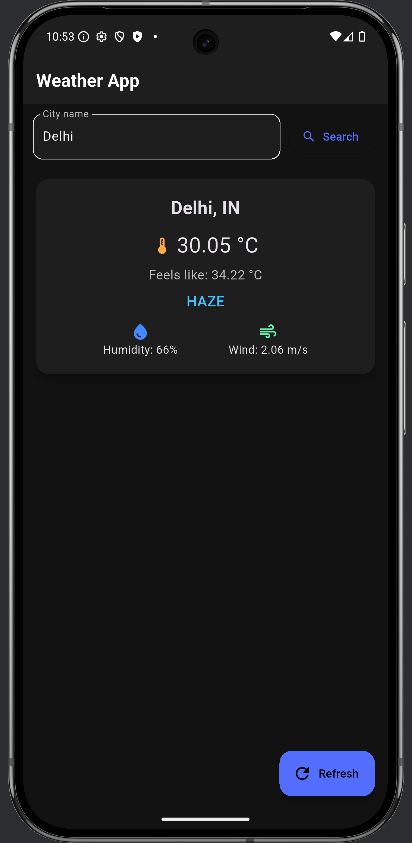

# Weather App - Flutter Assignment 6

A **dark-themed Flutter Weather App** that fetches live weather data from the OpenWeatherMap API and displays it in a user-friendly interface.

## Features

- Fetches live weather data for any city using **OpenWeatherMap API**
- Displays:
    - Temperature (°C)
    - Feels like temperature
    - Humidity
    - Wind speed
    - Weather description
- Dark theme UI for a modern look
- Loading indicator while fetching data
- Error handling for:
    - Invalid city names
    - API errors
    - Network issues
- Refresh button for quick updates

## Screenshots

### Weather Display


### Error State


## How it Works

1. **API Integration**
    - The app uses the [`http`](https://pub.dev/packages/http) package to make GET requests to OpenWeatherMap:
      ```dart
      final uri = Uri.parse('https://api.openweathermap.org/data/2.5/weather?q=$city&appid=$_apiKey&units=metric');
      final response = await http.get(uri);
      ```
2. **JSON Parsing**
    - The JSON response is decoded using `json.decode(response.body)` and relevant fields are extracted:
        - `main.temp` → Temperature
        - `main.feels_like` → Feels like
        - `main.humidity` → Humidity
        - `weather[0].description` → Weather description
        - `wind.speed` → Wind speed
3. **UI Update**
    - Data is displayed in a **Card widget** with icons and formatted text.
    - While fetching data, a **CircularProgressIndicator** is shown.
    - Errors are displayed with user-friendly messages.

## Dependencies

- Flutter SDK >= 3.8.1
- [http](https://pub.dev/packages/http)
- cupertino_icons

## Usage

1. Clone this repository:
   ```bash
   git clone https://github.com/<your-username>/<repo-name>.git
   cd weather_app
